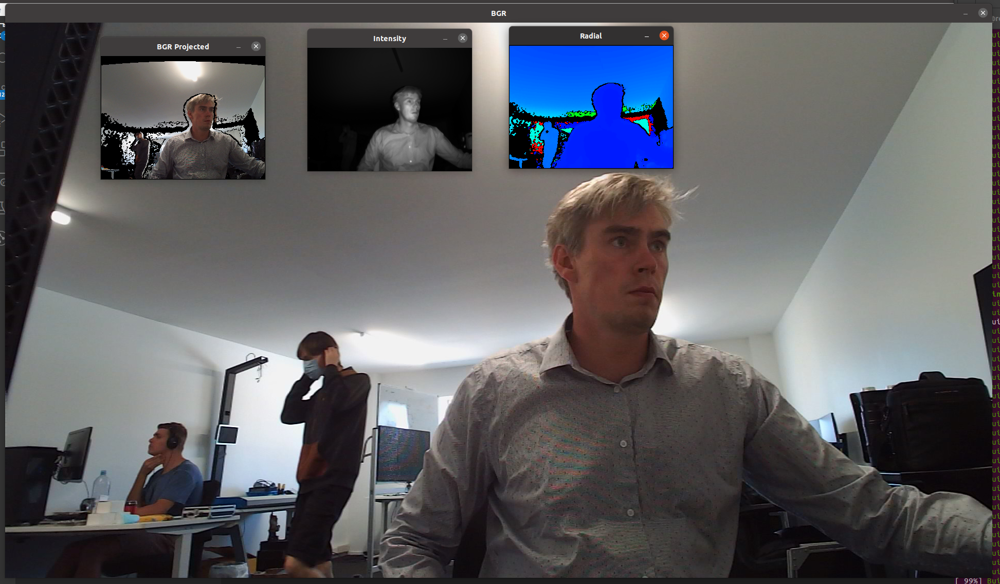

# Chronoptics Kea OpenCV Viewer Example 

## Setup instructions

1. Extract the ToF library 
2. Update line 9 of the CMakeLists.txt to ToF install location   
3. Install OpenCV and update line 11 of CMakeLists.txt, or remove the line

To build:

    make build && cd build 
    cmake ../
    make 

This produces kea_opencv_viewer 

    ./kea_opencv_viewer --list 

Will display all the detected cameras 

    ./kea_opencv_viewer --serial 202002a --dmax 30.0 --bgr --bgr_projected --fps 15.0

Is an example to display from camera 202002a. The output is display in 4 separate windows. To close the windows and stop the program hit 'Esc'. 

